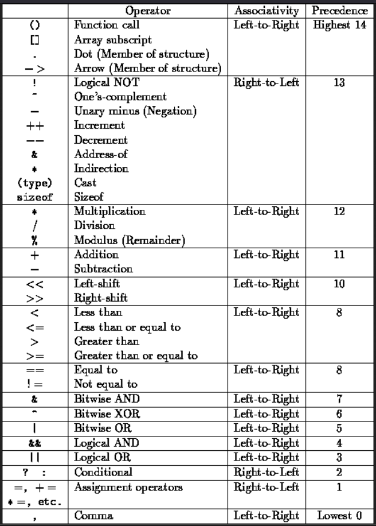

## History

- java made by Sun microsystems in 1991
- `James gosling` founder of java initially called Oak
- Goal is to create simple, portable and reliable language
- It's features are same as C/C++ but it has removed those features that bother developers
- It is first language of www(world wide web)

---

> Java is Purely OOPS

## How Java works ?

Java is compiled language and interpreted language also

source code ---compiled---> byte code ---interpreter---> Machine code

## JDK, JRE

1. Java Development Kit(JDK)
   **Collections of tools** for developing and running java programs
2. Java Runtime Environment(JRE)
   It is essential thing for executing a java program

---

Ope `Intellij IDEA` -> New project -> select java -> JDK : select path ( if not selected OR you have multiple versions of JDK installed ) -> next create

We're interested in creating of GUI applications using JAVA.

But, For simple learning purpose first we're going to create Command line application so that we can learn java. After that we create advance apps.

change some settings : File -> settings -> Appearance & behaviour -> appearance

Editor -> general -> check mouse wheel scroll zoom

---

In Java, file name should be same as class name that have main function
and class name should not be start with number ( It should start be with Alphabets ) 

---

## Structure of Java Program

Package groups functions and classes

`public static void main` is Function
In java function always belongs to class function can not be stood alone. `Main` is Class

Function is used for done a repetitive task
Class contain functions have similar functionalities. Function inside class called Method

Class is Template. Object is instance of the class.

> To Run a function we need to create object of class. but in our case we use static keyword with class that allows to run function without creating object. `void` means no-return value. `main` is name of function.
> main is starting point of java program
> `public` is access modifier that specify method can be access from anywhere

## naming convention in java

classes : PascalCase
function : camelCase

spaces are not allowed in identifier(variable/function/class name).

as per mk convention :-
variable : snake_case

## Comment

```java
// Single line comment
/* Multi line 
 * 
 * comment
 * 
 * */

```

---

## Package

it is used to store / separate classes.  It is used to group classes
Most of the time package is associated with `company`.

## variable

It is name given a memory location where data is stored. so that we can quickly access and each time we do not need to remember/ write the Addresses of main memory(RAM)

## Component of java program  OR Anatomy(શરીરરચના) of java program

- Documentation section : author name, code details ( Optional )
- package name ( Optional )
- import statements  ( Optional )
- interface statements  ( Optional )
- class Definitions ( Optional )
- Main method ( Mandatory, Essential for a Java program )

## Data Type

What type of value a variable can have that is determined using datatype
variable is container to store the value and data type of that container. (Example : Bottle, drum, etc ... )

Data type
| - Primitive data type (Intrinsic)
    | - int
    | - char
    | - float
    | - byte
    | - long
    | - double
    | - short
    | - bool
| - Non-Primitive data type (Derived)
> It is derived from non-primitive data types
> We'll see it later

> You don't need to make your brain as Hard Disk, you need to make your brain a good CPU. so that you can write efficient java program.

> In java, We need follow some rules to writing java code that set of Java program is called Syntax.


Reserve words OR keyword are word which is already reserve by Java. Java booked that word so we should ot use that keyword. That is Rule. 

## Variable naming Rule
- Should not start with digit
- name is case-sensitive means. `a` and `A` both consider different things.
- should not be Reserved word OR keyword.
- whitespace is not allowed
- can contain alphabets, _ , $
- `In Java, variable name can be starts with $ and _ `

> Java language is `statically typed` language. We need to declare explicitly and say to java what is type of variable.


### Datatypes
1. byte
- take 1 byte memory. Default value 0.
- range : -128 to 127

how to calculate range (proof) :-
1 byte = 8 bit. 1 byte has 8 bits
\- (2^8)/2  to  ( (2^8)/2 ) - 1
there is staring value is zero that's we need to add '-1' in right side.


| Datatype      | short | int | float | double | char     | boolean        |
|---------------|-------|-----|-------|--------|----------|----------------|
| Default value | 0     | 0   | 0.0f  | 0.0d   | "\00000" | depends on JVM |
| Bytes         | 2     | 4   | 4     | 8      | 2        | false          |

- Char stored as Unicode
Remember Java doesn't support ASCII characters it supports Unicode.
ASCII characters are subset of Unicode characters. Means character can have hindi alphabets

Official docs of java documentation : https://docs.oracle.com/javase/tutorial/java/nutsandbolts/datatypes.html

> Choose as small as possible Datatype as per your need  

---


System.out.print() // no new line 
System.out.println()  // new line added at the end

---

## Java literals
- floating point literal
- double  "    "
- long    "    "

- Choose the min and max value based on your need and as per that choose data type.

> A constant value which can be assigned to the variable is called as a literal

```java
byte age = 10; // 10 is literal value assigned to the int variable 
```


> Right click and Run the code in intellij idea because if you directly run then it run the previous file. once current file run the can use run button. that why you should take habit of right click and select Run from context menu.

> In intellij idea java files should be in `src` folder. and class file will store in `out` folder.  

> Move cursor to new line without effecting current line shortcut : shift + Enter

In java Character should be written in single quote. 
String should be written in Double quotes. that is rule.

## literals
Default type for decimal is double. when we write a float number it can be float or double. But default is double. for float we can use `f` to create value as float value. also you can use "F".
For double we can use "d" or "D". or we if we don't use still it is consider as double.

in case of integer by default it takes space of byte,short,int we don't need to explicitly mention
But long will not created by default(automatically)  for that we need to use `l` or we can also use `L`.

> java is pure object-oriented language. so, for each primitive data type we have class that is `java.lang` that we can see by write `Integer` and wait for intellisense and in it see to which class the int belongs same for other datatype. ( if intellisense not comes then you can use the ctrl+space  )
> Those are utility classes.
> Java is purely object-oriented but primitive datatypes are not actually object of class. It is implemented like Procedure oriented. 99% java is purely Object-oriented 

Best way to distinguish is primitive datatype has lowercase. and utility class has PascalCase


## keyword
Words which are reserved word in java compiler they can not use as identifier(variable/function/class name).


## Take input from user 
#### Reading input from keyboard
- In order to read data from keyboard Java has scanner class
- How it is implemented we don't need to go in that much detail. we just know it is class that interact with Keyboard hardware and help us to take user input.
- Scanner class has lots of methods to read the data from the keyboard
visit : **java_03_user_input.java**

First we need to import scanner class. It is some external code that we can use. that Code is by default not imported because it can increase the program size unnecessarily may be someone don't need user input in their program so they don't need to import Scanner class. 
It is like if you need then you can import for less memory and faster execution.


```
Java is like bani banayi khir use inbuid methods and do your work
```


## Plugin java code 
We can plug in already written java code in java GUI application, Web app, Android App.


---
---


> Note : Now notes will be inside the code from `java_06_operator.java`